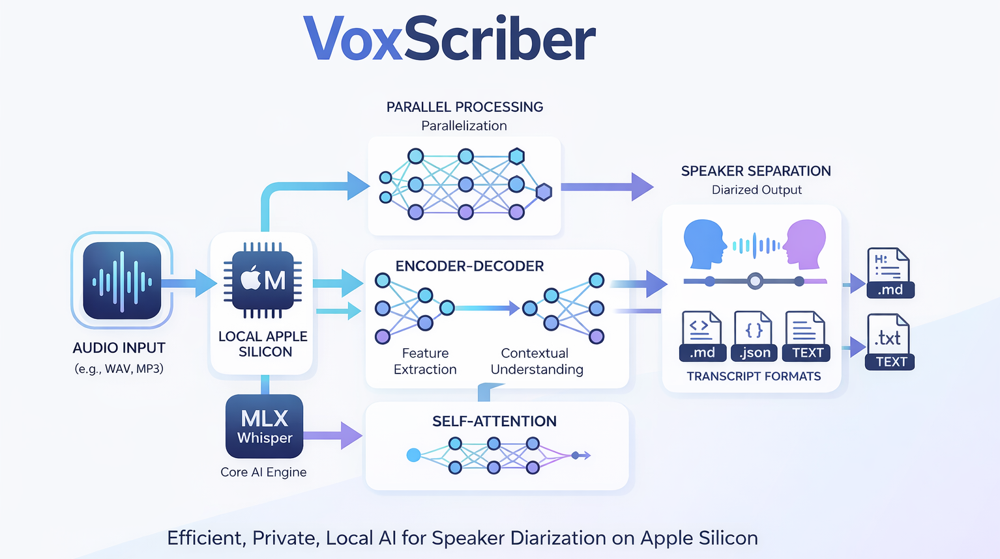

# VoxScriber

[](https://pypi.org/project/voxscriber/)
[](https://pepy.tech/project/voxscriber)
[](https://opensource.org/licenses/MIT)
[](https://www.python.org/downloads/)

Professional speaker diarization running 100% locally. Supports [MLX Whisper](https://github.com/ml-explore/mlx-examples/tree/main/whisper) on Apple Silicon and [faster-whisper](https://github.com/SYSTRAN/faster-whisper) on Linux/CUDA, combined with [Pyannote 3.1](https://github.com/pyannote/pyannote-audio).



## Requirements

- Python 3.10+
- [Hugging Face token](https://huggingface.co/settings/tokens) (free, one-time model download)
- For GPU: CUDA 12 + cuDNN 9 (optional, CPU works too)

That's it. No FFmpeg, no system packages, no sudo required.

## Installation

```bash
pip install voxscriber
```

The right Whisper backend is installed automatically:
- macOS Apple Silicon: MLX Whisper
- Linux/other: faster-whisper (CUDA or CPU)

### Setup Hugging Face Token

VoxScriber uses pyannote models which require a Hugging Face token.

**Option 1: Interactive setup (recommended)**

```bash
voxscriber-doctor
```

This will guide you through accepting the model terms and saving your token securely.

**Option 2: Using huggingface-cli**

```bash
# First, accept terms at https://huggingface.co/pyannote/speaker-diarization-3.1
huggingface-cli login
```

Your token will be saved to `~/.cache/huggingface/token` and used automatically.

**Option 3: Environment variable**

```bash
export HF_TOKEN=your_token_here
```

## Usage

```bash
# Basic
voxscriber meeting.m4a

# With known speaker count
voxscriber meeting.m4a --speakers 2

# All formats
voxscriber meeting.m4a --formats md,txt,json,srt,vtt

# Sentence-level subtitle segmentation for editing workflows
voxscriber meeting.m4a --formats srt,vtt --srt-mode sentence --srt-max-duration 15

# Print to console
voxscriber meeting.m4a --print
```

### Python API

```python
from voxscriber import DiarizationPipeline, PipelineConfig

config = PipelineConfig(
    num_speakers=2,
    language="en",
)
pipeline = DiarizationPipeline(config)
transcript = pipeline.process("meeting.m4a")

for segment in transcript.segments:
    print(f"{segment.speaker}: {segment.text}")
```

## Output Formats

| Format | Description |
|--------|-------------|
| `md` | Markdown with bold speaker names |
| `txt` | Timestamped plain text |
| `json` | Structured data with word-level timestamps |
| `srt` | SubRip subtitles |
| `vtt` | WebVTT subtitles |

## Options

```
voxscriber --help

  --speakers, -s    Number of speakers (if known)
  --language, -l    Force language (e.g., 'en', 'es')
  --model, -m       Whisper model (default: large-v3-turbo on GPU/MLX, small on CPU)
  --formats, -f     Output formats (default: md,txt)
  --output, -o      Output directory
  --device          auto (default), mps, cuda, or cpu
  --srt-mode        Subtitle segmentation mode for srt/vtt: speaker|sentence
  --srt-max-duration  Maximum subtitle duration in seconds for srt/vtt
  --quiet, -q       Suppress progress
  --print           Print transcript to console
```

## Performance

~0.1-0.15x RTF on Apple Silicon (MLX). ~0.15-0.25x RTF on NVIDIA GPUs (faster-whisper). A 20-minute recording processes in ~2-4 minutes depending on hardware.

## Troubleshooting

Run the diagnostic tool to check your setup:

```bash
voxscriber-doctor
```

This will check FFmpeg availability and HF_TOKEN, and offer to fix common issues automatically.

### Other Issues

| Issue | Solution |
|-------|----------|
| `requires Python >= 3.10` | Use Python 3.10+: `python3.10 -m venv .venv` |
| Installed wrong package | It's `voxscriber` (with 'r'), not `voxscribe` |
| `HF_TOKEN required` | Run `voxscriber-doctor` to set up authentication |

## Support

If you find VoxScriber useful, consider supporting its development:

[](https://buymeacoffee.com/dparedesi)
[](https://github.com/sponsors/dparedesi)

## License

MIT
